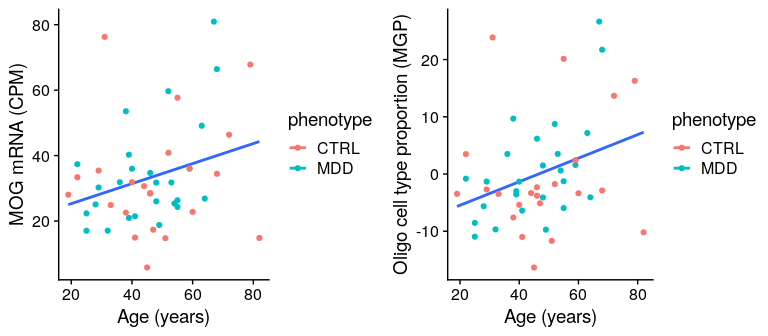

Functional Genomics Part 2 : Estimating cell type changes in aging and
depression
================
Shreejoy Tripathy
July 7, 2020

# Estimating relative cell type proportion changes in bulk brain gene expression data

In this tutorial, we will use a computational technique called Marker
Gene Profiles to estimate how proportions of cell types in the brain
change in conditions such as natural aging and in depression. The Marker
Gene Profiles tool is an example of a cell type deconvolution algorithm,
that attempts to decompose a bulk tissue gene expression sample into a
list of cell types.

Cell type deconvolution requires two components, first, a set of marker
genes per cell type that you want to estimate (these are often derived
from single-cell RNAseq data), and second, set of bulk tissue gene
expression samples.

You can learn more about the Marker Gene Profiles tool by reading the
[documentation](https://github.com/PavlidisLab/markerGeneProfile) and by
reading [Mancarci et
al, 2017](http://www.eneuro.org/content/4/6/ENEURO.0212-17.2017) that
describes it in greater detail. The Marker Gene Profiles tool makes use
of cell type specific marker genes that have been

### preliminaries

We are introducing more R packages that can be installed using
Bioconductor using `BiocManager` and from github using `remotes`.

These have already been installed into the Docker environment for you.
But we are leaving some install commands here for reference.

    ## install edgeR 
    # BiocManager::install("edgeR")
    
    # devtools::install_github('oganm/markerGeneProfile', force = T) # install marker gene profile tool from github

### loading R libraries

``` r
library(here)
library(tidyverse)
library(matrixStats)
library(cowplot)
library(broom)

theme_set(theme_cowplot())
```

``` r
library(edgeR)
library(markerGeneProfile) 
```

## Human cell type specific marker genes

We will now read in a list of cell type specific marker genes. These are
based on a re-analysis of [single-nucleus RNAsequencing
data](https://celltypes.brain-map.org/rnaseq/human_ctx_smart-seq) of the
Human Anterior Cingulate Cortex collected by the Allen Institute for
Brain Sciences. Sonny Chen, a post-doc in the Tripathy Lab, has
processed these data using standard pipelines to obtain cell type
specific marker genes for various cell types available in these data.

### Read in human cell type specific markers from external CSV file

Sonny has made available the markers in a CSV file. The column `gene`
indicates the gene name and the column `cluster` indicates the cell type
name. Other columns indicate the quality of each marker.

``` r
# read marker genes
acc_markers = read_csv(here('marker_genes','ACC_results.csv'))

cell_types = acc_markers$cluster %>% unique()

knitr::kable(head(acc_markers))
```

| X1 | gene   | entrez\_id | cluster      | adapted\_cluster\_name | pct.1 | pct.2 | avg\_logFC | MAST\_p\_val | MAST\_p\_val\_adj | roc\_myAUC | roc\_power |
| -: | :----- | ---------: | :----------- | :--------------------- | ----: | ----: | ---------: | -----------: | ----------------: | ---------: | ---------: |
|  1 | AARD   |     441376 | Inh\_LAMP5   | LAMP5.PAX6.Other       | 0.455 | 0.042 |   2.609194 |     0.00e+00 |         0.0000000 |      0.712 |      0.424 |
|  2 | ABCA1  |         19 | VLMC\_CYP1B1 | VLMC\_CYP1B1           | 0.818 | 0.431 |   2.810053 |     1.62e-05 |         0.8151503 |      0.796 |      0.592 |
|  3 | ABCA10 |      10349 | VLMC\_CYP1B1 | VLMC\_CYP1B1           | 1.000 | 0.466 |   3.640788 |     0.00e+00 |         0.0000000 |      0.999 |      0.998 |
|  4 | ABCA2  |         20 | Oligo        | Oligo                  | 0.951 | 0.439 |   3.143511 |     0.00e+00 |         0.0000000 |      0.928 |      0.856 |
|  5 | ABCA4  |         24 | VLMC\_CYP1B1 | VLMC\_CYP1B1           | 0.636 | 0.091 |   4.777892 |     0.00e+00 |         0.0000000 |      0.799 |      0.598 |
|  6 | ABCA6  |      23460 | VLMC\_CYP1B1 | VLMC\_CYP1B1           | 1.000 | 0.350 |   3.628789 |     0.00e+00 |         0.0000001 |      0.980 |      0.960 |

### Process markers data frame for marker gene profile function

``` r
marker_list <- lapply(cell_types, function(cell_type){
  return(acc_markers %>% filter(cluster == cell_type) %>% pull(gene) %>% unlist())
})
names(marker_list) <- cell_types
print(cell_types)
```

    ##  [1] "Inh_LAMP5"   "VLMC_CYP1B1" "Oligo"       "Endo_CLDN5"  "Inh_PAX6"   
    ##  [6] "Micro_C1QC"  "Peri_MUSTN1" "Inh_VIP"     "Astro_FGFR3" "Pyramidal"  
    ## [11] "OPC_MYT1"    "Inh_PVALB"   "Inh_SST"

### List names of marker genes of the SST cell type

``` r
print(marker_list$Inh_SST)
```

    ##  [1] "COL25A1"      "CORT"         "FBN2"         "FLT3"         "GRIK1"       
    ##  [6] "KLF5"         "LOC105372768" "LOC105373154" "NMU"          "PNOC"        
    ## [11] "SLC9A2"       "SST"

## Read and process bulk brain gene expression data

We will now process the bulk brain gene expression data into the form
needed for the Marker Gene Profile
function.

### Read in the Labonte dataset metadata and gene expression count matrix

``` r
labonte_meta <- read_csv(file = here('data','labonte_dlpfc_meta.csv')) %>%
  select(geo_accession, 
         expr_names, 
         age = age.ch1, 
         gender = gender.ch1, 
         pmi = pmi.ch1, 
         rin = rin.ch1, 
         ph = ph.ch1, 
         phenotype = phenotype.ch1)

labonte_expr <- read_tsv( 
  here('data',"GSE102556","GSE102556-expression.counts.ARCHS4.txt.zip")) %>%
  select(c("gene_symbol", labonte_meta$geo_accession)) %>%
  column_to_rownames("gene_symbol") %>% as.data.frame()
knitr::kable(labonte_expr[1:5, 1:5])
```

|       | GSM2740657 | GSM2740658 | GSM2740659 | GSM2740660 | GSM2740661 |
| ----- | ---------: | ---------: | ---------: | ---------: | ---------: |
| A1BG  |        147 |        194 |        268 |        175 |        133 |
| A1CF  |         37 |         70 |         61 |         19 |         71 |
| A2M   |       2539 |       2719 |       3594 |       3405 |       2087 |
| A2ML1 |        129 |        162 |        208 |        169 |        133 |
| A2MP1 |         36 |         87 |         89 |         67 |         56 |

### Normalize the gene expression dataset into Counts Per Million

Because of differences in sequencing depth between the different bulk
brain gene expression samples, we will normalize for these differences
using the [Counts Per Million](https://rdrr.io/bioc/edgeR/man/cpm.html)
metric in the library `edgeR`.

``` r
labonte_cpm <- edgeR::cpm(labonte_expr, log = F, prior.count = 0)
knitr::kable(labonte_cpm[1:5, 1:5])
```

|       | GSM2740657 | GSM2740658 | GSM2740659 |  GSM2740660 | GSM2740661 |
| ----- | ---------: | ---------: | ---------: | ----------: | ---------: |
| A1BG  |   9.272959 |   7.618538 |  12.062437 |   7.3245726 |   5.354102 |
| A1CF  |   2.334010 |   2.748957 |   2.745555 |   0.7952393 |   2.858205 |
| A2M   | 160.163557 | 106.777341 | 161.762678 | 142.5152557 |  84.015126 |
| A2ML1 |   8.137495 |   6.361872 |   9.361891 |   7.0734444 |   5.354102 |
| A2MP1 |   2.270929 |   3.416561 |   4.005809 |   2.8042649 |   2.254359 |

## Process expression matrix prior to MGP analysis

The code below filters the gene expression dataset to keep only genes
whose names are unique.

``` r
use_gene_list <- labonte_cpm %>% rownames() %>% unlist %>% unique()
gene_mat <- labonte_cpm[use_gene_list, ]
```

### Calculate genes with very low standard deviations and remove them from the expression matrix

``` r
gene_sds <- rowSds(gene_mat %>% as.matrix(), na.rm = T) 
gene_mat <- gene_mat[gene_sds > .1, ]
```

### Reshape gene expression matrix

``` r
gene_mat <- gene_mat %>% 
  as.data.frame() %>% 
  tibble::rownames_to_column(var = 'gene_name')

gene_mat = gene_mat %>% distinct(gene_name, .keep_all = T)
gene_names = gene_mat$gene_name
rownames(gene_mat) = rownames(gene_mat) %>% make.names(unique=T)
gene_mat_trans = gene_mat[-1] %>% t() %>% as.data.frame()
colnames(gene_mat_trans) = gene_names
```

### Merge sample metadata matrix with gene expression matrix

``` r
gene_mat_trans <- gene_mat_trans %>% 
  tibble::rownames_to_column(var = 'geo_accession')

# merge gene expression and meta data frames
gene_mat_comb <- inner_join(labonte_meta, gene_mat_trans, by = 'geo_accession')
```

## Run cell type proportion estimation

Now that we’ve processed our cell type marker gene lists and our bulk
gene expression data, we can now run the Marker Gene Profile function.
The function requires to major inputs, `exprData`, which is the bulk
expression dataset (here, it is `gene_mat`), and `genes`, which is the
list of marker genes per list of cell types (here, it is `marker_list`).
Please see the Marker Gene Profile documentation for more information
about the other optional inputs to the function.

``` r
# run MGP analysis
estimations <-  mgpEstimate(
  exprData=gene_mat,
  genes=marker_list,
  geneColName='gene_name',
  outlierSampleRemove=F, # should outlier samples removed. This is done using boxplot stats.
  geneTransform = NULL, # this is the default option for geneTransform
  groups=NULL, #if there are experimental groups provide them here. if not desired set to NULL
  seekConsensus=FALSE, # ensures gene rotations are positive in both of the groups
  removeMinority=TRUE) 
```

    ## Warning in mgpEstimate(exprData = gene_mat, genes = marker_list, geneColName = "gene_name", : Several cell types have a high proportion (>0.4) of their genes filtered out. Excercise caution.
    ## Problematic cell types are: Inh_LAMP5

### Merge relative cell type proportions per cell type with sample metadata

``` r
mgp_estimates <- as.data.frame(estimations$estimates) %>%
  tibble::rownames_to_column(var = 'geo_accession')

mgp_df <- inner_join(labonte_meta, mgp_estimates, by = "geo_accession")
knitr::kable(mgp_df[1:5, 1:12])
```

| geo\_accession | expr\_names | age | gender |   pmi | rin |   ph | phenotype |  Inh\_LAMP5 | VLMC\_CYP1B1 |       Oligo | Endo\_CLDN5 |
| :------------- | :---------- | --: | :----- | ----: | --: | ---: | :-------- | ----------: | -----------: | ----------: | ----------: |
| GSM2740657     | X14.BA8\_9  |  47 | Male   | 12.00 | 7.8 | 6.49 | CTRL      |   3.3120676 |     1.224542 |  \-5.120755 |    2.111566 |
| GSM2740658     | X17.BA8\_9  |  41 | Male   | 24.00 | 7.6 | 6.00 | CTRL      | \-1.0412195 |   \-2.526716 | \-10.996570 |  \-4.842098 |
| GSM2740659     | X20.BA8\_9  |  31 | Male   | 29.50 | 6.9 | 6.67 | CTRL      | \-1.0366583 |     3.945572 |   23.862311 |    3.427710 |
| GSM2740660     | X23.BA8\_9  |  19 | Male   | 27.75 | 7.7 | 6.74 | CTRL      |   0.4192951 |   \-6.710968 |  \-3.456838 |  \-4.255103 |
| GSM2740661     | X28.BA8\_9  |  46 | Male   | 19.50 | 7.7 | 6.42 | CTRL      |   0.2003983 |   \-4.426125 |  \-3.791668 |  \-6.955322 |

## Generate plots illustrating cell type proportions

### Plot SST mRNA and relative SST cell type proportion versus subject age

``` r
sst_mrna_vs_age_fig <- gene_mat_comb %>% 
  ggplot(aes(x = age, y = SST, color = phenotype, group = 1)) +  
  geom_smooth(method = "lm", se = F) + geom_point() + 
  ylab('SST mRNA (CPM)') + xlab('Age (years)')

# plot SST cell type proportion (MGP) vs age
sst_prop_vs_age_fig <- mgp_df %>% 
  ggplot(aes(x = age, y = Inh_SST, color = phenotype, group = 1)) + 
  geom_smooth(method = "lm", se = F) + geom_point() + 
  ylab('SST cell type proportion (MGP)') + xlab('Age (years)')

# plot subplots together
plot_grid(sst_mrna_vs_age_fig, sst_prop_vs_age_fig, nrow = 1)
```

<!-- -->

### Plot MOG mRNA and Oligo MGP vs age

MOG is a marker of Oligodendrocytes.

``` r
mog_mrna_vs_age_fig <- gene_mat_comb %>% 
  ggplot(aes(x = age, y = MOG, color = phenotype, group = 1)) +  
  geom_smooth(method = "lm", se = F) + geom_point() + 
  ylab('MOG mRNA (CPM)') + xlab('Age (years)')

oligo_prop_vs_age_fig <- mgp_df %>% 
  ggplot(aes(x = age, y = Oligo, color = phenotype, group = 1)) + 
  geom_smooth(method = "lm", se = F) + geom_point() + 
  ylab('Oligo cell type proportion (MGP)') + xlab('Age (years)')

plot_grid(mog_mrna_vs_age_fig, oligo_prop_vs_age_fig, nrow = 1)
```

<!-- -->

### merge MGPs with metadata matrix

``` r
labonte_meta_plus_mgps <- inner_join(labonte_meta, mgp_df)
```

    ## Joining, by = c("geo_accession", "expr_names", "age", "gender", "pmi", "rin", "ph", "phenotype")

## Use statistical models to estimate the effects of age, depression, and other variables

We will use R’s linear modeling function `lm` to fit a statistical model
against each cell type proportion and a number of covariates, including
gender, pH, RIN (RNA integrity number), PMI (post mortem interval), Age,
and Phenotype (control / depression status).

The model form here is: `cell_type_prop ~ gender + ph + rin + pmi + age
+ phenotype`

``` r
mod_df_list <- lapply(cell_types, function(cell_type_name){
  curr_formula = paste0('scale(', cell_type_name, ') ~ gender + scale(ph) + scale(rin) + scale(pmi) + scale(age) + phenotype')
  curr_mod = lm(curr_formula, data = labonte_meta_plus_mgps)
  
  
  mod_df = tidy(curr_mod)
  mod_df$cell_type = cell_type_name
  return(mod_df)
  
}) %>% bind_rows()
mod_df_list = mod_df_list %>% select(cell_type, term, everything())

# also do an adjustment for multiple comparisons using the Benjamini-Hochberg method
mod_df_list$padj <- p.adjust(mod_df_list$p.value, method = 'BH')

# do minor formatting of data frame
replace_terms <- c('Intercept', 'gender:Male', 'pH', 'RIN', 'PMI', 'age', 'disorder:MDD')
mod_df_list$term <- plyr::mapvalues(mod_df_list$term, from = c(mod_df_list$term %>% unique), to = replace_terms)
```

### Print standardized beta coefficients for each cell type and the depression disease status

``` r
# print data frame for just MDD beta coefficients
knitr::kable(mod_df_list %>% filter(term == 'disorder:MDD'))
```

| cell\_type   | term         |    estimate | std.error |   statistic |   p.value |      padj |
| :----------- | :----------- | ----------: | --------: | ----------: | --------: | --------: |
| Inh\_LAMP5   | disorder:MDD | \-0.1850316 | 0.2512223 | \-0.7365253 | 0.4656047 | 0.6830462 |
| VLMC\_CYP1B1 | disorder:MDD | \-0.2802607 | 0.2777750 | \-1.0089487 | 0.3189169 | 0.6449208 |
| Oligo        | disorder:MDD |   0.1893715 | 0.2554373 |   0.7413621 | 0.4626994 | 0.6830462 |
| Endo\_CLDN5  | disorder:MDD | \-0.1541532 | 0.2946617 | \-0.5231531 | 0.6036838 | 0.7737356 |
| Inh\_PAX6    | disorder:MDD | \-0.2308515 | 0.2836545 | \-0.8138474 | 0.4204340 | 0.6830462 |
| Micro\_C1QC  | disorder:MDD | \-0.1278428 | 0.2931898 | \-0.4360410 | 0.6650944 | 0.8106836 |
| Peri\_MUSTN1 | disorder:MDD | \-0.2332056 | 0.2928345 | \-0.7963734 | 0.4304023 | 0.6830462 |
| Inh\_VIP     | disorder:MDD | \-0.3639626 | 0.2561300 | \-1.4210074 | 0.1628761 | 0.4248359 |
| Astro\_FGFR3 | disorder:MDD | \-0.2094883 | 0.2825966 | \-0.7412979 | 0.4627379 | 0.6830462 |
| Pyramidal    | disorder:MDD | \-0.0954358 | 0.2849260 | \-0.3349495 | 0.7393708 | 0.8516803 |
| OPC\_MYT1    | disorder:MDD | \-0.2346329 | 0.2752749 | \-0.8523585 | 0.3989669 | 0.6830462 |
| Inh\_PVALB   | disorder:MDD | \-0.1927934 | 0.2206790 | \-0.8736374 | 0.3874042 | 0.6830462 |
| Inh\_SST     | disorder:MDD | \-0.2520474 | 0.1981794 | \-1.2718140 | 0.2106062 | 0.4914144 |

### Print standardized beta coefficients for each cell type and sample age

``` r
# print data frame for just age beta coefficients
knitr::kable(mod_df_list %>% filter(term == 'age'))
```

| cell\_type   | term |    estimate | std.error |   statistic |   p.value |      padj |
| :----------- | :--- | ----------: | --------: | ----------: | --------: | --------: |
| Inh\_LAMP5   | age  | \-0.2979740 | 0.1354239 | \-2.2003066 | 0.0334764 | 0.1603344 |
| VLMC\_CYP1B1 | age  |   0.1818673 | 0.1497373 |   1.2145756 | 0.2314771 | 0.5137663 |
| Oligo        | age  |   0.5692241 | 0.1376960 |   4.1339193 | 0.0001718 | 0.0043663 |
| Endo\_CLDN5  | age  |   0.3083098 | 0.1588403 |   1.9410052 | 0.0591534 | 0.2563313 |
| Inh\_PAX6    | age  |   0.0203873 | 0.1529067 |   0.1333314 | 0.8945835 | 0.9504945 |
| Micro\_C1QC  | age  |   0.0862264 | 0.1580469 |   0.5455746 | 0.5883146 | 0.7648089 |
| Peri\_MUSTN1 | age  |   0.1337371 | 0.1578553 |   0.8472132 | 0.4017948 | 0.6830462 |
| Inh\_VIP     | age  | \-0.5641812 | 0.1380694 | \-4.0862143 | 0.0001988 | 0.0043663 |
| Astro\_FGFR3 | age  |   0.2635602 | 0.1523365 |   1.7301188 | 0.0911311 | 0.3455389 |
| Pyramidal    | age  | \-0.4286104 | 0.1535922 | \-2.7905746 | 0.0079502 | 0.0516760 |
| OPC\_MYT1    | age  | \-0.1264494 | 0.1483897 | \-0.8521444 | 0.3990843 | 0.6830462 |
| Inh\_PVALB   | age  | \-0.4961363 | 0.1189592 | \-4.1706422 | 0.0001535 | 0.0043663 |
| Inh\_SST     | age  | \-0.5658757 | 0.1068306 | \-5.2969448 | 0.0000043 | 0.0003909 |

### Make plots showing the effect of age and major depression on cell type proportions

``` r
# beta coeffs per cell type for phenotype and age effects
beta_plot <- mod_df_list %>% 
  filter(term %in% c('disorder:MDD', 'age')) %>% 
  ggplot(aes(x = cell_type, y = estimate)) + 
  geom_hline(yintercept = 0) + 
  geom_bar(stat = "identity") + 
  geom_errorbar(aes(ymin = estimate - std.error, ymax = estimate + std.error)) + 
  ylab('Std. Beta coeff.') + 
  xlab('Cell type proportions') + 
  theme(axis.text.x = element_text(angle = 90, vjust = 0.5, hjust=1)) +
  facet_wrap(~term)

beta_plot
```

<!-- -->
